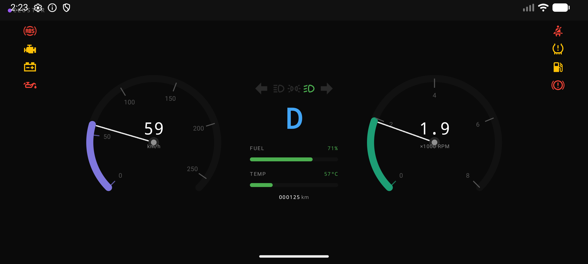

# Cluster - AAOS Instrument Cluster

A privileged system application for Android Automotive OS (AAOS) that reads live
vehicle data through the Car Property API and renders an instrument cluster with
speed, RPM, gear, fuel, coolant temperature, odometer and telltales.



---

## Tech Stack

| Layer | Technology |
|-------|------------|
| Language | Kotlin |
| UI | Jetpack Compose + Material Design 3 |
| Architecture | MVVM + Repository pattern |
| DI | Dagger 2 |
| Async | Kotlin Coroutines + StateFlow |
| Platform | Android Automotive OS (AAOS), AOSP |
| Car APIs | `CarPropertyManager` |
| Build | Soong (`Android.bp`), platform-signed privileged app |

---

## Architecture

```
ClusterActivity
    └── ClusterViewModel          (StateFlow<ClusterData>)
            └── ClusterRepository (interface)
                    └── ClusterRepositoryImpl
                            └── CarPropertyManager -> VHAL property subscription
```

Data flow: VHAL events -> `CarPropertyManager.CarPropertyEventCallback` ->
`MutableStateFlow<ClusterData>` -> ViewModel -> Compose recomposition.

`ClusterRepositoryImpl` connects to Car Service asynchronously with
`CAR_WAIT_TIMEOUT_DO_NOT_WAIT`, subscribes to the required VHAL properties, and
keeps the UI updated without blocking app startup.

---

## Features

- Speed gauge in km/h
- RPM gauge in x1000 RPM
- Current gear display: P/R/N/D
- Fuel bar: green normally, red when low
- Coolant temperature bar in °C: blue when cold, green normal, red when hot
- Odometer display in km
- Live telltales for ABS, engine overheat, battery fault, oil level, seat belt,
  TPMS, fuel, parking brake, low beam, high beam and turn signals
- OEM-overridable colours in `res/values/colors.xml`

---

## Subscribed Vehicle Properties

| Property | Area / Notes | Unit | Rate | UI field |
|----------|-------------|------|------|----------|
| `PERF_VEHICLE_SPEED` | global | m/s | UI | `speedKmh` (× 3.6) |
| `ENGINE_RPM` | global | rpm | UI | `rpmX1000` (÷ 1000) |
| `GEAR_SELECTION` | global | enum | on-change | `gear` — P=4 R=2 N=1 D=8 |
| `ENGINE_COOLANT_TEMP` | global | °C | normal | `coolantTempC`; `engineWarning` at ≥ 110 °C |
| `ENGINE_OIL_LEVEL` | global | enum | on-change | `oilWarning` — active when ≠ 2 (normal) |
| `PERF_ODOMETER` | global | km | normal | `odometerKm` |
| `FUEL_LEVEL` | global | mL | normal | `fuelPercent`; `fuelWarning` at ≤ 15% |
| `INFO_FUEL_CAPACITY` | global | mL | read once | divisor for `fuelPercent` |
| `ABS_ACTIVE` | global | boolean | on-change | `absEngaged` — ABS currently braking (transient) |
| `0x21400002` (vendor) | global | INT32 | on-change | `absFault` — ABS fault requiring service (persistent); `absActive = absEngaged \|\| absFault` |
| `0x21400003` (vendor) | global | INT32 | on-change | `seatbeltWarning` — 1 = unbuckled, 0 = buckled |
| `0x21400004` (vendor) | global | INT32 | on-change | `batteryWarning` — battery/charging fault; 1 = warning, 0 = normal |
| `PARKING_BRAKE_ON` | global | boolean | on-change | `brakeWarning` |
| `HEADLIGHTS_STATE` | global | enum | on-change | `lowBeamOn` (1), `parkingLightsOn` (2) |
| `HIGH_BEAM_LIGHTS_STATE` | global | enum | on-change | `highBeamOn` (≠ 0) |
| `TURN_SIGNAL_LIGHT_STATE` | global | bit flags | on-change | `turnSignalLeft` (bit 2), `turnSignalRight` (bit 1) |
| `TIRE_PRESSURE` | `0x1` FL `0x2` FR `0x4` RL `0x8` RR | kPa | normal | `tpmsWarning` — any wheel below its configured min pressure; fallback to 80% of configured max |

### Emulator note — telltales

On the reference emulator the VHAL does not automatically fire `ABS_ACTIVE`,
`PARKING_BRAKE_ON`, `ENGINE_OIL_LEVEL` or `TIRE_PRESSURE`. These indicators
will stay dark until the property is injected. Run
`./test_properties.sh telltales` to exercise every telltale and light in order.

---

## Testing

Run the property walkthrough on the host while the emulator/device is running:

```bash
cd vendor/autobox/apps/Cluster

./test_properties.sh            # full run (drive → engine → fuel → odometer → telltales)
./test_properties.sh drive      # speed (km/h), all 4 gear positions, RPM
./test_properties.sh engine     # coolant temperature bar and engine warning
./test_properties.sh fuel       # fuel bar, fuel percent, fuel warning
./test_properties.sh odometer   # odometer km
./test_properties.sh telltales  # remaining telltales and lights: ABS, battery, oil,
                                #   seatbelt, TPMS, brake,
                                #   parking lights, low beam, high beam, turn signals
./test_properties.sh check      # VHAL property config + current values for every UI field
                                #   (TIRE_PRESSURE areas: 0x1, 0x2, 0x4, 0x8)
```

The script forces transitions (off → on → off) so each indicator can be visually
confirmed without duplicate checks.

The engine warning icon maps to high coolant temperature (≥ 110 °C) because AAOS
does not expose a generic `CHECK_ENGINE` boolean. The temperature bar turns red
independently at 90 °C.

If `adb` is not on PATH:

```bash
export PATH=$PATH:$(pwd)/out/host/linux-x86/bin
```

### Manual adb commands

```bash
# Speed is injected in m/s. UI displays km/h.
adb shell cmd car_service inject-vhal-event PERF_VEHICLE_SPEED 25.0

# Gear: P=4, R=2, N=1, D=8.
adb shell cmd car_service inject-vhal-event GEAR_SELECTION 8

# RPM is injected in rpm. UI displays x1000 RPM.
adb shell cmd car_service inject-vhal-event ENGINE_RPM 2800

# Coolant temperature in °C. Engine warning is shown at 110°C+.
adb shell cmd car_service inject-vhal-event ENGINE_COOLANT_TEMP 110

# Fuel level in mL. Emulator capacity is commonly 15000 mL.
adb shell cmd car_service inject-vhal-event FUEL_LEVEL 1500

# Battery/charging warning (vendor property 0x21400004).
adb shell cmd car_service inject-vhal-event 0x21400004 1   # warning on
adb shell cmd car_service inject-vhal-event 0x21400004 0   # warning off

# Odometer in km.
adb shell cmd car_service inject-vhal-event PERF_ODOMETER 85432

# ABS fault (vendor property 0x21400002 = VENDOR_ABS_FAULT).
# ABS_ACTIVE signals transient braking; this signals a persistent fault requiring service.
adb shell cmd car_service inject-vhal-event 0x21400002 1   # fault on
adb shell cmd car_service inject-vhal-event 0x21400002 0   # fault cleared

# Driver seat belt warning (vendor property 0x21400003).
# 1 = unbuckled, 0 = buckled.
adb shell cmd car_service inject-vhal-event 0x21400003 1

# Parking brake.
adb shell cmd car_service inject-vhal-event PARKING_BRAKE_ON 1

# Lights: 0 = off, 1 = low beam, 2 = parking/daytime lights.
adb shell cmd car_service inject-vhal-event HEADLIGHTS_STATE 2
adb shell cmd car_service inject-vhal-event HEADLIGHTS_STATE 1
adb shell cmd car_service inject-vhal-event HIGH_BEAM_LIGHTS_STATE 1

# Turn signals: none=0, right=1, left=2, hazards=3.
adb shell cmd car_service inject-vhal-event TURN_SIGNAL_LIGHT_STATE 2

# Engine oil level: critically low=0, low=1, normal=2, high=3, error=4.
adb shell cmd car_service inject-vhal-event ENGINE_OIL_LEVEL 1

# TPMS, area IDs: 0x1 FL, 0x2 FR, 0x4 RL, 0x8 RR.
# Warning is shown below 80% of the wheel's configured max pressure.
adb shell cmd car_service inject-vhal-event TIRE_PRESSURE 0x1 160.0   # FL low -> TPMS on
adb shell cmd car_service inject-vhal-event TIRE_PRESSURE 0x1 250.0   # restore FL

# Inspect properties.
adb shell cmd car_service get-property-value ABS_ACTIVE 0
adb shell cmd car_service get-property-value PARKING_BRAKE_ON 0
adb shell cmd car_service get-property-value 0x21400003
adb shell cmd car_service get-property-value ENGINE_COOLANT_TEMP 0
adb shell cmd car_service get-property-value ENGINE_OIL_LEVEL 0
adb shell cmd car_service get-property-value 0x21400004
adb shell cmd car_service get-property-value PERF_VEHICLE_SPEED 0
adb shell cmd car_service get-property-value ENGINE_RPM 0
adb shell cmd car_service get-property-value GEAR_SELECTION 0
adb shell cmd car_service get-property-value PERF_ODOMETER 0
adb shell cmd car_service get-property-value TIRE_PRESSURE 0x1   # FL
adb shell cmd car_service get-property-value TIRE_PRESSURE 0x2   # FR
adb shell cmd car_service get-property-value TIRE_PRESSURE 0x4   # RL
adb shell cmd car_service get-property-value TIRE_PRESSURE 0x8   # RR
adb shell cmd car_service get-carpropertyconfig FUEL_LEVEL
adb shell cmd car_service get-carpropertyconfig TURN_SIGNAL_LIGHT_STATE
adb shell dumpsys car_service --services CarPropertyService
```

---

## Project Structure

```
Cluster/
├── src/com/autobox/cluster/
│   ├── ClusterActivity.kt
│   ├── ClusterApplication.kt
│   ├── di/                         Dagger component, modules, factory
│   ├── model/                      ClusterData and Gear
│   ├── repository/
│   │   ├── ClusterRepository.kt    interface
│   │   ├── constants/
│   │   │   ├── ClusterDefaults.kt  thresholds and fallback values
│   │   │   └── VendorProperties.kt vendor property IDs (0x21400xxx)
│   │   └── impl/
│   │       ├── ClusterRepositoryImpl.kt  real Car API implementation
│   │       └── MockClusterRepository.kt simulation for local dev/reference
│   └── ui/
│       ├── ClusterViewModel.kt
│       ├── ClusterScreen.kt        Compose instrument cluster UI
│       └── ClusterTheme.kt         Material theme backed by resources
├── design/
│   └── cluster.png                 UI screenshot
├── res/
│   ├── drawable/                   telltale icons
│   └── values/                     colours, dimensions, strings, theme
├── test_properties.sh              VHAL property walkthrough script
├── Android.bp                      Soong build definition
├── AndroidManifest.xml
└── privapp-permissions-cluster.xml
```
